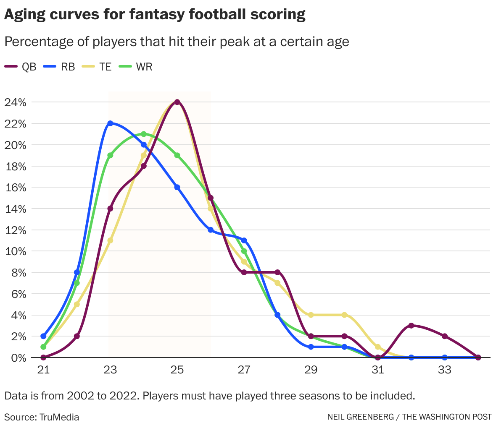

### Survival analysis and athlete aging curves

The application of survival analysis in sports does not use a time-based probability of occurrence like many engineering risk examples do. A [study by Bullock et al.](https://www.nature.com/articles/s41598-021-87920-6) in **Nature Scientific Reports** (April 2021) counted injuries where athletes missed games in the four major U.S. professional sports (baseball, basketball, football, hockey) between 2007-2019. They found for 54,944 total injuries there were an average of 62.49 injuries per 100 players per season.

More often injury occurrences are counted by exposures where a single exposure is either a practice or game. Other reputable papers count 64.7 injuries for 1000 exposures in NFL games during one NFL team 10-year pre-season totals in [*Epidemiology of National Football League Training Camp Injuries from 1998 to 2007*](https://journals.sagepub.com/doi/10.1177/0363546508316021) in **The American Journal o f Sports Medicine** (April 2008). There were 44.8 injuries for 1000 exposures for NCAA Division 1 football games between 2014-15 and 2018-19 based on[ *Epidemiology of Injuries in National Collegiate Athletic Association Men's Football: 2014-2015 Through 2018-2019*](https://pubmed.ncbi.nlm.nih.gov/34280281/) in **Journal of Athletic Training** in  (July 2021).

One NFL game counts as one injury exposure, so a rough estimate for a single player experiencing an injury in a game is approximately is 0.005 or 0.5%.

[Estimates vary](https://mrrelevantdotcom1.wordpress.com/2014/09/16/average-nfl-career-of-three-seasons-is-completely-wrong/) for NFL players' career length. An old but still often-used figure is 3.3 years across all players. Sports participation and achievement is often governed by Pareto (80-20) or Pareto-like distributions. Depending on player ability, the careers of quality NFL players is more likely 8, 12 or 15 years long. Obsolescence would not seem to be well represented by retirement in professional NFL football.

An alternative is to estimate the peak performance years for NFL players and then use aging curves to describe players' post-peak decline. Pro Football Focus analyst Timo Riske [describes](https://www.pff.com/news/nfl-investigating-positional-aging-curves-with-pff-war) the peak value years for NFL players (averaged across positions) is 26-28 before player values drops at more rapid rates. This sets up a survivor model where the two events are (1.) injury and (2.) rapid post-peak decline. Like the class example, each event is a distinct path to the same endpoint, which is the end of a professional football playing career.

The model has:

1.  Initial value based on talent projection based on draft round or salary (though NFL draft position [has been shown](https://faculty.wharton.upenn.edu/wp-content/uploads/2013/08/massey---thaler---losers-curse---management-science-july-2013.pdf) to be an inaccurate indicator of a football player's realized value.)

2.  *A~i~* = \[injury occurs in game *i*\] =\>

    $$
    p = 0.005
    $$

3.  *B~i~* = \[positive or negative player development or decline in game *i*\] =\> *r* ... positive development (negative decline) more likely during early-career and less likely during late-career ... so start at Game 70, which is 4-5 seasons into an NFL career.

    $$
    r_i = 1 - e^{-0.001i}
    $$

$$ P[\mathrm{development/decline\ through}\ j] = (1-p)^{i} \prod_{i=1}^{j-1}(1-r_{i}) $$

$$ P[\mathrm{career\ ends\ in\ game}\ j] = [p + r_j - pr_j](1-p)^{i} \prod_{i=1}^{j-1}(1-r_{i}) $$

First, let's inspect the probability for a player's decline that comes after their initial early-career development period. 

```{r}

J <- 70:(70 + (6*17)) 
games <- c() 
surv <- c() 
for (j in J) { 
  game <- j - 69 
  games <- c(games, game) 
  prob <- (1 - 0.995*exp(-0.001*game))*(0.995^(game-1))*prod(exp(-0.001*games)) 
  surv <- c(surv, prob) 
} 
chart_data <- rbind(surv) 
barplot(chart_data, names.arg = games, xlab = "Games Played", ylab = "P(development/decline)")
```

The barplot is consistent with this 2023 graph of aging curves based on players' fantasy football scoring [by The Washington Post](https://www.washingtonpost.com/sports/2023/08/24/fantasy-football-risk-rankings/).

[](https://www.washingtonpost.com/sports/2023/08/24/fantasy-football-risk-rankings/)

Second, the probabilities in an injury occurrence survival analysis during the same games sequence shows tiny probabilities.

```{r}

J <- 70:(70 + (6*17)) 
games <- c() 
surv <- c() 
chart_data <- c()
for (j in J) { 
  game <- j - 69 
  games <- c(games, game) 
  prob <- ((0.005 + (1-exp(-0.001*max(J)))-(0.005)*(1-exp(-0.001*max(J))))^game)*(1-exp(-0.001*game))
  surv <- c(surv, prob) 
}
chart_data <- rbind(surv) 
#barplot(chart_data)
barplot(chart_data, names.arg = games, xlab = "Games Played", ylab = "P(injury)")
  
```
### Demand-to-Capacity Model: Capacity

Athletes, regardless of sport, age, or size have a finite Capacity. Repetive stresses wear down soft tissues. Collisions have the potential to further compromise soft tissues. Exercise scientists at the University of North Carolina [published methodology](https://arxiv.org/abs/2503.11815) to measure accumulated wear and tear on athletes based on player tracking data. Player tracking uses GPS or, if indoor, radio tracking to capture an X-Y position for every player on the court or field location, taking measurements at 10-30 frames per second. 

Many college and professional sports gather [player tracking data](https://www.annualreviews.org/content/journals/10.1146/annurev-statistics-033021-110117). The NFL has gathered this type of data for years. The NFL also organizes an annual data science analytics competition called the [Big Data Bowl](https://operations.nfl.com/gameday/analytics/big-data-bowl/) which asks the sports data science community to contribute insights based on football player tracking data.

The original method for gauging athlete Capacity is a measurement called "training load." The number that training load represents is an indication of the accumulated work by an athlete during a day of sports training, practice or competition. By itself the work by athlete in a single day is not very useful. Sports, especially at its highest levels, involves repetitive stresses, like with running but encompassing a wide range of movement patterns necessary for a particular sport. The preferred method for determining when training load is approaching Capacity is something called Acute-Chronic Workload Ratio (ACWR), putting the short-term training load in the numerator (acute) and the longer-term training load in the denominator (chronic). A [2020 commentary](https://www.lukebornn.com/papers/impellizzeri_jospt_2020a.pdf) by Impellizzeri et al. in **Journal of Orthopaedic & Sports Physical Therapy** debunked the practice, writing that higher training loads increased the number of injury exposures (remember from before) and there was no causal evidence for more injuries from higher training loads in the numerator of a high ACWR.

The opportunity to get a handle on athletic Capacity goes through player tracking, merited in part by the attention given to the recent UNC paper. Theoretically, visualizing player tracking data stands to produce a biomechanical movement signature. The insight of the UNC paper is that changes in direction, accurately captured with player tracking, are substantially more wear and tear than unencumbered straight-ahead running. The collisions that are also present in football player tracking data should also be additive in terms of athlete wear and tear.

```{ojs}
d3 = require("d3@7")
receivers = FileAttachment("receivers.json").json()
receivers_offset = FileAttachment("receivers_offset.json").json()
r_offset = d3.group(
  receivers_offset,
  (d) => d.nfl_id,
  (d) => d.play_id
)
collisions = FileAttachment("collisions.json").json()

```

```{ojs}

chart = {
  // Declare the chart dimensions and margins.
  const marginTop = 20;
  const marginRight = 1;
  const marginBottom = 40;
  const marginLeft = 40;
  const rowHeight = 22;
  const width = 1200;
  const height =
    rowHeight * Array.from(new Set(d3.map(receivers, (d) => d.nfl_id))).length +
    marginTop +
    marginBottom;

  // Create the scales.
  const x = d3
    .scaleLinear()
    // max value from receievers_offset.csum
    .domain([1, d3.max(receivers_offset, (d) => d.csum)])
    .rangeRound([marginLeft, width - marginRight]);

  const y = d3
    .scaleBand()
    .domain(Array.from(new Set(d3.map(receivers, (d) => d.nfl_id))))
    .rangeRound([marginTop, height - marginBottom]);

  const color = d3.scaleSequentialSqrt(
    [0, d3.max(receivers, (d) => d.dist)],
    d3.interpolateHsl("#ddd", "red")
  );

  // Create the SVG container.
  const svg = d3
    .create("svg")
    .attr("viewBox", [0, 0, width, height])
    .attr("viewBox", [0, 0, width, height])
    .attr("width", width)
    .attr("height", height)
    .attr("style", "max-width: 100%; height: auto;");

  // Append the axes.
  svg
    .append("g")
    .attr("transform", `translate(0,${height - marginBottom})`)
    .call(d3.axisBottom(x).ticks(width / 80))
    .call((g) => g.select(".domain").remove())
    .call((g) =>
      g
        .append("text")
        .attr("x", width)
        .attr("y", marginBottom - 4)
        .attr("fill", "currentColor")
        .attr("text-anchor", "end")
        .text("frame →")
    );

  svg
    .append("g")
    .attr("class", "grid")
    .attr("transform", `translate(${marginLeft},0)`)
    .call(d3.axisLeft(y).tickSize(-width))
    .call((g) => g.select(".domain").remove())
    .call((g) =>
      g
        .append("text")
        .attr("x", -marginLeft)
        .attr("y", 10)
        .attr("fill", "currentColor")
        .attr("text-anchor", "start")
        .text("↑ player")
    );

  // visuals
  // tracking paths with velocity as grey-red gradient
  svg
    .append("g")
    .selectAll("path")
    .data(receivers)
    .join("path")
    .attr("transform", (d) =>
      isNaN(d.dist)
        ? `translate(${x(
            d.frame_id + r_offset.get(d.nfl_id).get(d.play_id)[0].offset
          )}, ${y(d.nfl_id)}) scale(0.1,3)`
        : `translate(${x(
            d.frame_id + r_offset.get(d.nfl_id).get(d.play_id)[0].offset
          )}, ${y(d.nfl_id)}) rotate(${d.dir}) scale(${0.2 + d.dx},${1 + d.dy})`
    )
    .attr("fill", (d) =>
      isNaN(d.dist) ? "#000" : color(d.dist)
    )
    .attr("d", d3.symbol(d3.symbolTriangle));

  // collisions with black filled circles
  svg
    .append("g")
    .selectAll("path")
    .data(collisions)
    .join("path")
    .attr(
      "transform",
      (d) =>
        `translate(${x(
          d.frame_id + r_offset.get(d.nfl_id).get(d.play_id)[0].offset
        )}, ${y(d.nfl_id)}) scale(0.5,0.5)`
    )
    .attr("fill", "#000")
    .attr("d", d3.symbol(d3.symbolCircle));

  return svg.node();
}

```

The graph shows the 60 most used receivers in games during the first NFL weekend of 2017. Blobs are bright red when the players are running full speed (or close to it). Blobs are narrow when players run primarily straight ahead (X-axis in the data) and the blobs get wider as player run across the field (Y-axis in the data). Collisions, or more accurately close contacts, between offense and defense players occur when plays occupy the same X,Y coordinate in the data. Vertical bars separate plays. The graph's Y-axis shows players' "nfl_id." The graph's X-axis shows the frame count. The player tracking operates at 10 frames per second.

These are single game snapshots of player activity. As with training load, one day's information is not very useful. Work remains to generate multi-game graphs for players. It is also important to note how Player Capacity can fluctuate. 

Player Capacity increases with physical preparation training. There is a dose-response relationship between training and Capacity. Like medicine, the exercise that occurs during training is helpful and promotes resilience, but only to a point. Too much training can result in overuse, diminishing Capacity and increasing injury risk.

### Demand-to-Capacity Model: Demand

Game Demand is mostly under the control of coaches and team management who are in charge of a team's Game Model and Game Plans. The Game Model refers to a team's architecture and how they plan to use a player, in large part based on the player's ability and skill set. Player value is reflected in the salary a player is paid. Game Plans are game-to-game refinements of the Game Model directed at the strengths and weakness of the opponent competition.

Post-hoc Game Model and Plan analysis can be accomplished by looking at the play-by-play data from games. For example, the throw in football passing plays are either shorter or longer than the distance required for a first down. Receivers are targeted based their ability to get first downs, either via shorter or longer throws.

* $\mathrm{prob\ of\ catch\ when\ } xyac_{fd} > 0.99 => who$ 
* $\mathrm{prob\ of\ catch\ when\ } xyac_{fd} < 0.99 * prob\ expected_{fd}$ 
* $x:play\_type == pass \ \&\& \ \mathrm{prob\ of\ negative\ epa\ } (epa < 0)$

The quarterback of a football has up to six eligible receivers on a passing play. There are also two distinct scenarios on a passing play. Throw past the first down distance so that a catch ensures a first down. Or throw short of first down distance and leave the receiver work to do (in the form of yards after catch, yac) to gain the first down. Each receiver has a probability for getting a first down when the throw distance is less than first down distance (lt_fd) and another probability when the throw distance is greater than first down distance (gt_fd). These probabilities are mutually exclusive but not independent and the added probabilities (pr_gt_fd + pr_lt_fd) is the net probability for a targeted receiver getting a first down.

The probability of a fumble by the receiver after a catch is, however, independent. Lost fumble turnovers are rare but costly occurrences for the football offense. The best NFL teams, in many cases, minimize their turnovers.

```{r}
#| label: load-packages

library(gt)
```

```{r}
#\| nflfastr

nflfastR::load_pbp(2025) |> 
  dplyr::group_by(receiver, receiver_id, posteam) |> 
  dplyr::filter(play_type == "pass", air_yards < yardline_100, posteam == "DET") |> 
  dplyr::mutate(neg_play = ifelse(
    sack == 1, 1, ifelse(
      fumble_lost == 1, 1, ifelse(
        interception == 1, 1, 0)))) |> 
  dplyr::mutate(exp_fd = ifelse(xyac_fd >= 0.99, 1, 0)) |> 
  dplyr::mutate(actual_exp_fd = ifelse(xyac_fd >= 0.99 & first_down, 1, 0)) |> 
  dplyr::mutate(not_fd = ifelse(xyac_fd < 0.99, 1, 0)) |> 
  dplyr::mutate(actual_not_fd = ifelse(xyac_fd < 0.99 & first_down, 1, 0)) |> 
  dplyr::summarize( 
    passes = dplyr::n(), 
    neg_pct = sum(neg_play) / dplyr::n(), 
    gt_com = sum(exp_fd*(complete_pass)), 
    gt_fd = sum(exp_fd, na.rm=TRUE), 
    actual_gt_fd = sum(actual_exp_fd, na.rm=TRUE), 
    gt_fd_pct = actual_gt_fd / gt_fd, 
    lt_com = sum(not_fd*(complete_pass)), 
    lt_fd = sum(not_fd, na.rm=TRUE), 
    actual_lt_fd = sum(actual_not_fd, na.rm=TRUE), 
    lt_fd_pct = actual_lt_fd / lt_fd ) |> 
  dplyr::ungroup() |> 
  dplyr::select(receiver, posteam, passes, neg_pct, gt_com, gt_fd, actual_gt_fd, gt_fd_pct, lt_com, lt_fd, actual_lt_fd, lt_fd_pct) |> 
  gt()
```

In the table "gt\_" refers to passes that travel greater than the distance to the first down. "lt\_" refers to passes that travel less than the distance to the first down. "neg_pct" refers to percent of passes that are caught and then fumbled to the other team. The principal receivers for DET are A.St.Brown (ASB), J.Gibbs (JG), J.Williams (JW) and S.LaPorta (SLP).

```{r}
data.frame( receiver = c("A.St.Brown","J.Gibbs","J.Williams","S.LaPorta"), abbrev = c("ASB", "JG", "JW", "SLP"), gt_fd = c(0.79, 0.33, 0.47, 0.69), lt_fd = c(0.35, 0.18, 0.55, 0.26), fumble = c(0.02, 0, 0.03, 0) ) |> 
  gt()
```

"epa" stands for Expected Points Added. Fumble turnovers and first downs have an average epa.

```{r}

nflfastR::load_pbp(2025) |> 
  dplyr::filter(play_type == "pass", air_yards < yardline_100, fumble_lost == 1 | first_down == 1) |> 
  dplyr::summarize( epa_fumble = sum(epa * fumble_lost) / sum(fumble_lost), epa_fd = sum(epa* first_down) / sum(first_down)) |> 
  gt()
```


* $\mathrm{expected\ return\ on\ throw\ beyond\ first\ down} = P[\mathrm{gt\_fd}] * epa_{fd} + P[\mathrm{fumble}] * epa_{fumble}$
* $\mathrm{expected\ return\ on\ throw\ short\ of\ first\ down} = P[\mathrm{lt\_fd}] * epa_{fd} + P[\mathrm{fumble}] * epa_{fumble}$


| receiver | gt_fd epa | lt_fd epa |
|:--------:|:---------:|:---------:|
|   ASB    |   1.18    |   0.48    |
|    JG    |   0.52    |   0.28    |
|    JW    |   0.63    |   0.76    |
|   SLP    |   1.10    |   0.46    |


Detroit has two receivers, A.St.Brown and S.LaPorta, who are good at getting first downs on longer throws and on shorter throws. J.Williams is a threat on short throws but struggles to catch longer throws. J.Gibbs is a reliable target on shorter throws but converts a small percentage of those passes into first downs.


### Demand-to-Capacity Model: Ratio Function

Use the ratio model for failure function.

$$failure function = \frac{Capacity}{Demand}$$
$$failure = \frac{Capacity}{Demand} < 1$$
$$improvement \mathrm{\ or\ } decline = \frac{\sum_{0}^{n}{\frac{Capacity}{Demand}}}{n}$$

It should be possible to model injuries with a Demand-to-Capacity model but it is probably more effective to use it to model a player's decline.